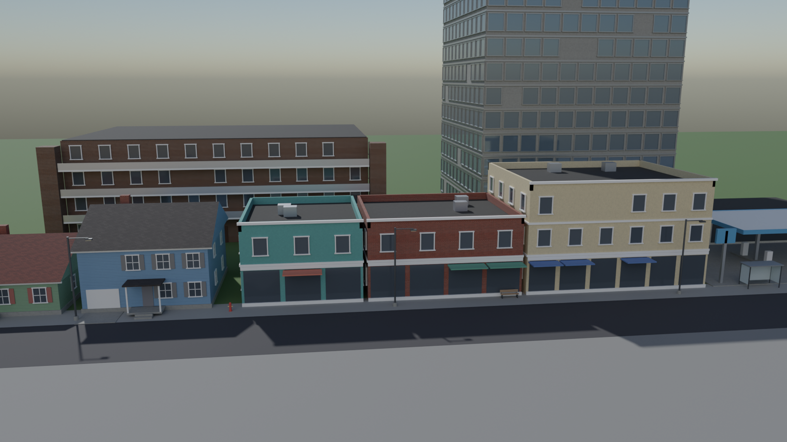

# Asset Pipeline (Blender → Unity)

Covers GDD §79–80 and §156. Code: `Tools/Blender/hg_pipeline`, `Game/Assets/_Project/Editor/ModelImportRules.cs`.

## 1. Tools
* **Blender 4.2 LTS** (or `pip install bpy==4.2.0` on Python 3.11 for headless automation/CI).
* **Git LFS** for `.blend`, `.fbx`, textures and audio (see `.gitattributes`). Run `git lfs install` before committing art.

## 2. Units, axes, pivots
| Rule | Value |
|---|---|
| Units | metric, 1 Blender unit = 1 m, unit scale 1.0 |
| Up axis in Blender | +Z |
| Export | FBX, `axis_forward=-Z`, `axis_up=Y`, `apply_scale_options=FBX_SCALE_UNITS`, `bake_space_transform=True` |
| Transforms | rotation and scale applied (identity) before export |
| Pivot | ground-level centre of the footprint for buildings/props; hinge for doors; wheel centres for wheels |
| Front | buildings face −Y in Blender (→ −Z in Unity = towards the street in layout data) |

## 3. Naming
| Prefix | Asset | Example |
|---|---|---|
| `SM_` | static mesh | `SM_Storefront_2F_A` |
| `SK_` | skeletal mesh | `SK_Pedestrian_Female_A` |
| `M_` | material | `M_Brick_Red` |
| `T_` | texture + suffix `_BC` base colour, `_N` normal, `_M` HDRP mask, `_ORM`, `_E` emissive, `_H` height | `T_Brick_Red_N` |
| `A_` | animation clip | `A_Walk_Fwd` |
| `_LODn` | LOD level suffix on meshes (LOD0 = full) | `SM_Bench_A_LOD2` |
| `UCX_<mesh>_NN` | convex collision hull | `UCX_SM_Bench_A_01` |

## 4. Budgets (LOD0 triangles / minimum LOD levels / collision)
| Category | LOD0 tris | LODs | UCX required | Unity folder (under `Assets/_Project/Art/`) |
|---|---|---|---|---|
| Buildings | 60,000 | 4 | yes | `Environment/Buildings` |
| Props | 6,000 | 3 | yes | `Environment/Props` |
| StreetFurniture | 3,000 | 3 | yes | `Environment/StreetFurniture` |
| Vehicles | 90,000 | 4 | yes | `Vehicles` |
| Characters | 70,000 | 3 | no (capsules at runtime) | `Characters` |
| Vegetation | 15,000 | 4 | no | `Environment/Vegetation` |
| Interiors | 20,000 | 2 | yes | `Environment/Interiors` |

Source of truth: `hg_pipeline/conventions.py` (`BUDGETS`, `UNITY_FOLDERS`).

## 5. Validation (runs before every export)
`hg_pipeline.validate.validate_asset(objects, category)` checks: names; applied scale/rotation; UV maps; material slots
and `M_` names; plausible size (0.01–500 m); ground-level origin; n-gons (warning); LOD0 budget; LOD count and
contiguity; each LOD actually reduces; required UCX hulls; hull vertex count ≤ 255 (PhysX). Export refuses assets with
errors (use `--lenient` only for experiments). A JSON sidecar `<asset>.pipeline.json` records LOD triangle counts,
hulls, materials and issues.

## 6. Automation
* **LODs:** `lod_collision.generate_lods` — planar dissolve then collapse decimation per level (ratios per category).
* **Collision:** `lod_collision.generate_convex_collision` — convex hull(s) around LOD0, named `UCX_…`.
* **UVs:** generators emit world-space box-projected UV0 (tileable materials line up across modules) and a second
  `Lightmap` channel for baked lighting / APV.
* **Procedural kit:** `hg_pipeline.kit.CATALOG`. It holds these buildings:
  * storefront blocks (1–3 floors)
  * office towers (4, 8 and 16 floors)
  * a warehouse
  * shotgun houses and suburban houses (1–2 floors, porch, shutters, chimney, optional garage)
  * garden and mid-rise apartments
  * a gas station and a church

  It also holds street props: a street light, bench, hydrant, bollard, bus shelter and dumpster.
* **Textures:** `hg_pipeline.textures` generates 16 tileable PBR surfaces (base colour + normal map): brick,
  stucco, concrete, siding, shingles, gravel roof, corrugated and standing-seam metal, and wood. It uses numpy only.
  * Each texture covers 2 m and matches the kit's box-projected UVs.
  * Pattern sizes are rounded so they repeat a whole number of times per tile. `tests/test_textures.py` fails on any
    seam.
* **What Unity gets:** `kit` writes the FBX files, and also these three:
  * `Environment/Textures/T_*_BC|_N.png`
  * `Environment/Materials/KitMaterials.json` (colour, roughness, metallic and texture names per material)
  * `Environment/Buildings/KitBuildings.json` (footprint, height, and the place kinds each building can represent)

  In the editor, the JSON files are used in three places:
  * `KitMaterials.cs` builds `M_*.mat` for the active pipeline from `KitMaterials.json`. **HeroGame ▸ Art ▸ Refresh
    Kit Materials** re-runs it.
  * `ModelImportRules.OnAssignMaterialModel` assigns those materials by name.
  * `KitBuildings.cs` fits the closest building to every lot when the greybox scene is built. Kinds without a kit
    building keep a box.
* **Not in LFS:** the generated kit under `Art/Environment/` stays out of Git LFS (`.gitattributes`), so GitHub ZIP
  downloads and Unity Hub clones get real files.
* **Preview:** `cli.py preview` renders a textured street with Cycles (below).

```bash
# Headless (CI or any machine with Python 3.11)
pip install bpy==4.2.0
python Tools/Blender/cli.py kit --art-root Game/Assets/_Project/Art
python Tools/Blender/cli.py preview --out docs/images/blender_kit_preview.png --textures Game/Assets/_Project/Art/Environment/Textures
python -m unittest discover -s Tools/Blender/tests -v

# Inside Blender
blender -b -P Tools/Blender/cli.py -- kit --art-root Game/Assets/_Project/Art --only SM_Bench_A
```


*Headless Cycles render of the generated kit with its procedural textures. First-pass art, not final.*

## 7. Unity import contract (`ModelImportRules`)
For assets under `Assets/_Project/Art/`: scale factor 1 with file scale, bake axis conversion, no cameras/lights,
external materials matched by name, Mikk tangents, no generated colliders; `UCX_*` meshes become convex
`MeshCollider`s (renderers removed); `*_LODn` renderers are grouped into a `LODGroup` (transitions 50/20/7/2 %);
textures ending `_N` import as normal maps, `_M`/`_ORM` as linear; streaming mip-maps on. Characters under
`/Characters/` import as Humanoid.

## 8. Blender MCP integration
`hg_pipeline.mcp_commands` is the command surface for AI-driven asset work through an MCP server running inside
Blender (any Blender MCP add-on that can execute Python can call it; a dedicated add-on is planned). All commands take
and return JSON:

| Command | Purpose |
|---|---|
| `list_commands`, `list_catalog`, `conventions_info` | discovery |
| `build_asset(name, art_root, strict)` | generate → LOD → collision → validate → export one catalog asset |
| `validate_selection(category)` | validate whatever the artist/agent selected |
| `generate_lods(object, ratios)` / `generate_collision(object)` | automation on existing meshes |
| `export_selection(category, art_root, name, strict)` | validated export of selected objects |

```bash
python Tools/Blender/cli.py mcp '{"command": "list_catalog"}'
```

Principles: agents never bypass validation; commands never delete data they did not create; every export writes a
report so the Unity side and reviewers can audit what was produced.

## 9. Quality bar (GDD §115, §156)
The procedural kit establishes scale, silhouettes, material zones and pipeline plumbing. Every generated asset is
tracked in [`ASSET_TRACKER.md`](ASSET_TRACKER.md) with its replacement status; final assets need artist-authored
detail, trim sheets, baked normals and material textures before the "POLISHED" label.
